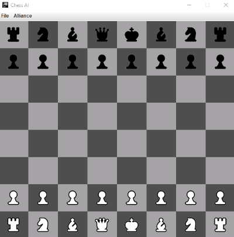

### What is the project about?
High-level description of the project comes here.
### How to run the code?

You could "checkout" the project with your preferred IDEA or alternatively:

1. Download this project onto your PC
2. Install java JDK onto your PC from here:
https://docs.oracle.com/javase/10/install/toc.htm
3. Open a command prompt window and go to the directory where you saved the java program.
4. Compile the code using the javac command plus java file name such as: 
"javac Main.java" 
5. Once the project has been compiled, type 
"java Main" 
to run the program. The game will begin in your command line.
6. Have fun :)

### The engine.
Description of the engine comes here. Searching algorithms, decision tree, etc..
### The GUI.
Description of java swing comes here, followed by a pic/gif as illustration.  

### Areas for possible developement:
There is plenty of room for improvement. A few of the ideas I have in mind:
* Implementing cool features.
* Expanding the test coverage to 100%.
* Implementing other search algorithms.
* Etc...

If you would like to contribute to this project you are very welcome to do so. Please open an issue so that we can discuss your idea.